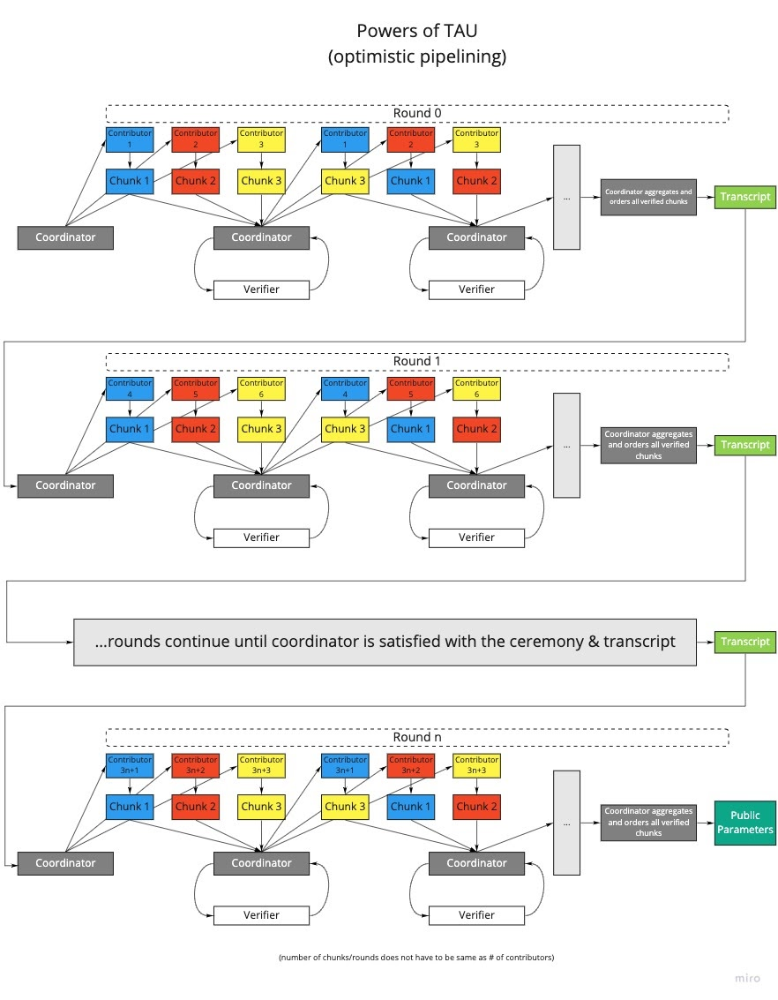

# Aleo Setup `phase1-coordinator` Requirements

Vaguely following the format outlined here: <https://www.lucidchart.com/blog/software-requirements-documentation>.

This document contains documentation of the required functionality for the [`phase1-coordinator`](../) module.

Related overall setup requirements document here [Aleo Setup PRD][Aleo Setup PRD]

## Purpose

The purpose of the `phase1-coordinator` module is to provide the logic for performing a [setup ceremony](#setup-ceremony) in the form of a Rust library that can be consumed by a web server which provides the communication layer between the [coordinator](#coordinator) and [participants](#participant).

## Definitions

Definitions of various terms which are relevant to the purpose and implementation of the `phase1-coordinator`. This list is sorted in alphabetical order, however a good place to start with general reading is at the [Setup Ceremony](#setup-ceremony)

### Aggregation

TODO: what specifically is aggregation doing?

### Challenge

A challenge forms the basis for a [contribution](#contribution).

TODO: what specifically is a challenge?

### Chunk

The parameters are broken into chunks so that multiple [contributor](#contributor)s can make contributions in parallel. See [Optimistic Pipelining](#optimistic-pipelining) for an overview of the process.

### Contribution

A contribution is a subset of the setup parameters generated by a [contributor](#contributor) in the form of a file. A [chunk](#chunk) contains one contribution for each contributor in the round. Contributions are created sequentially, each contribution first needs to be verified by a [verifier](#verifier) before it can be used as a base for a subsequent contribution.

As part of the design for [Optimistic Pipelining](#optimistic-pipelining), at the end of a round, each [chunk](#chunk) will contain one contribution for each contributor participating in the round.

### Contributor

A contributor is a type of [participant](#participant), typically run by a member of the public who wishes to participate in the [ceremony](#setup-ceremony) by making [contributions](#contribution). There are currently two contributor software implementations: [cli contributor](#cli-contributor) (in this repository) and the [web contributor](#web-contributor). A contributor runs this software to participate in the ceremony. If a contributor is [dropped](#drop) during a [round](#round) they can be replaced by a [Replacement Contributor](#replacement-contributor).

A contributor's contributions are verified by a [Verifier](#verifier) participant before they are accepted and can have other contributions made based on them.

#### CLI Contributor

The CLI contributor software allows members of the public to make contributions to the ceremony via a piece of cross-platform (Windows, Mac, Linux) command line interface (CLI) softare written in Rust. It can be found at [`setup1-contributor`](../../setup1-contributor)

#### Web Contributor

The web contributor is contributor software that runs in a browser so that members of the public can contribute simply by navigating to the relevant web page. The repository for this project can be found at [`aleo-setup-frontend`](https://github.com/AleoHQ/aleo-setup-frontend). Currently it's only planned to use the web contributor for the [inner setup](#inner-setup).

### Coordinator

The coordinator directs [participants](#participant) to perform the [Setup Ceremony](#setup-ceremony), and collates/checks the all chunks/contributions before continuing to the next [round](#round) of the ceremony. The core logic for the coordinator is contained within this [`phase1-coordinator`](../) module, and the web server interface to this logic resides in the [`aleo-setup-coordinator` repository](https://github.com/AleoHQ/aleo-setup-coordinator/).

### Drop

A participant may be "dropped" from a [round](#round) in progress by the [Coordinator](#coordinator) for a variety of reasons. In the case of a dropped [Contributor](#contributor) this involves removing their contributions, and, replacing them with a [Replacement Contributor](#replacement-contributor).

### Environment

Currently Aleo is considering running the [setup ceremony](#setup-ceremony) multiple times, with different configurations of curves, proving systems, and size. Currently these are classed as [inner](#inner-setup), [outer](#outer-setup), and [universal](#universal-setup) setups (in order of complexity).

#### Inner Setup

The inner setup will be the least computationally expensive setup configuration. In order to encourage more members of the public to contribute, the inner setup will be open to [web contributors](#web-contributor) which can be operated simply from a web browser.

TODO: specifically what is the inner setup for?

#### Outer Setup

TODO: specifically what is the outer setup for?

#### Universal Setup

TODO: specifically what is the universal setup for?

This is the most computationally expensive setup configuration.

### Optimistic Pipelining

The marketing logic is that by making it easy for more people to contribute, it will increase the public's perceived trustworthiness of the system in question. **Optimistic Pipelining** is a new technique implemented for this project to allow [contributor](#contributor)s to make contributions in parallel for a given round.

With optimistic pipelining:

+ For a given [round](#round) the [parameters](#parameters) are divided into [chunk](#chunk)s. **TODO**: is this the correct terminology?.
+ A [chunk](#chunk) will be contributed to once by every contributor in the round, each [contribution](#contribution) is based on the previous.
+ After a contribution has been made to a chunk, it needs to be verified before another contributor can make the next contribution.
+ A chunk can only have one contributor at a given time.
+ At the end of a round, the [coordinator](#coordinator) performs [aggregation](#aggregation) on the contributions.

See [Setup Ceremonies ZKProof][Setup Ceremonies ZKProof] for a more detailed explanation and background for this technique.

### Parameters

TODO: specifically what are the parameters?

### Participant

A participant is an actor (in the form of software) who performs a role during the [Setup Ceremony](#setup-ceremony): the [coordinator](#coordinator) provides them with tasks to perform. There are currently two types of participants: [contributor](#contributor)s and [verifiers](#verifier)s. A participant may be operated by an actual member of the public, or by aleo in the form of a [verifier](#verifier) or [replacement contributor](#replacement-contributor).

### Replacement Contributor

A [contributor](#contributor) run by `aleo` which waits idle for a contributor to be [dropped](#drop) from a [round](#round) in progress, at which point the [coordinator](#coordinator) will assign it to take over the dropped contributor's tasks to allow the round to be completed.

### Round

A round of the [setup ceremony](#setup-ceremony). Each round ideally consists of a new set of [contributor](#contributor)s. A ceremony will consist of many rounds in order to involve more contributors across a larger time scale. The number of contributors in a single round is limited, so this also provides a mechanism to increase capacity for unique contributors in the ceremony.

### Round Queue

A queue where [participants](#participant) wait to join the next [round](#round). If there not enough spaces in the next round available, some participants will remain in the queue until there is an available slot in a round.

### Setup Ceremony

A **Setup Ceremony** (or **Setup** for short) is currently necessary pre-requisite task for a Zero Knowledge cryptography system. The aim of a setup is to generate a set of [parameters](#parameters) using random numbers which will be used as a basis for proofs **TODO is this correct?**. In order for the system to be trustworthy, the source of randomness needs to be discarded. The ceremony is in effect, a public stage-show where members of the public are invited to participate as [contributor](#contributor)s. The advantage of involving multiple contributors from the public is that in order for the system to be trustworthy, only one contributor needs to be honest with disposing of their source of randomness used to generate parameters.

In contrast to previous public setup ceremonies, Aleo setup will be making use of the [Optimistic Pipelining](#optimistic-pipelining) technique to allow more contributions in a shorter space of time.

Extra useful references:

+ [Zcash Parameter Generation](https://z.cash/technology/paramgen/)
+ [Setup Ceremonies ZKProof][Setup Ceremonies ZKProof]

### Verification

TODO: what specificially is a verification?

A verification is calculated from a [contribution](#contribution) by a [verifier](#verifier).

### Verifier

A type of [participant](#participant) which verifies a [contributor](#contributor)'s [contributions](#contribution) before it can be used as a base for subsequent contributions or in the next [round](#round).

## System Description

### User Characteristics

#### Coordinator Operator (Aleo)

Aleo is the company developing this software, and ultimately the primary user of the software as it will using the module to operate a central [coordinator](#coordinator) node to perform a [setup ceremony](#setup-ceremony).

It is expected that the `phase1-coordinator` module will be consumed by [`aleo-setup-coordinator`](https://github.com/AleoHQ/aleo-setup-coordinator/), a web server written in Rust running on top of the Tokio async runtime.

#### Public Contributors

Public contributors are members of the public who have decided to contribute to the [setup ceremony](#setup-ceremony) by operating a [contributor](#contributor) node during a [round](#round) of the ceremony.

These people are expected to have an interest in using the Aleo system and want to be able to trust the system by participating themselves. Some of these users may expect sufficient evidence that their contribution was effective.

It is expected that contributors in the [Inner Setup](#inner-setup) ceremony will be willing to run a node for at least a couple of hours in their web browser, and that contributors in the [Universal Setup](#universal-setup) ceremony will be willing to run a high performance node for around 5-10 hours.

#### Aleo System Users

Some members of the public who are using the Aleo system which depends upon the parameters generated in the setup ceremony may wish to convince themselves of the soundness of the ceremony with the historical evidence publicly available.

## Requirements

Requirements have been denoted with a `REQ-N` notation where `N` is the number referring to a specific requirement to allow easy and consistent referencing. See the references at the end of this document for a complete list of requirements including the latest.

### Interface Requirements

#### REQ-8 Concurrency

Many API endpoints will be expected to be called concurrently with multiple [participant](#participant)s working in parallel, and with this library being consumed by an asynchronous web server. It is expected that the API will provide a threadsafe API, with an effort to reduce the need for exclusive or expensive blocking locks on internal resources with unexpected performance implications for the caller.

#### REQ-9 Async

If it is expected that an operation will block on an operating system resource or on a thread synchronization primitive, this should be well documented, and ideally an async API should be provided instead to prevent the caller's event loop from being blocked or the need to spawn unecessarily expensive threads.

### Functional Requirements

#### REQ-1 Evidence of Soundness

As mentioned in [Public Contributors](#public-contributors) and [Aleo System Users](#aleo-system-users), it is expected that some members of the public will want some form of evidence that the [ceremony](#setup-ceremony) conducted was correct, without serious mistakes with security consequences. Making the evidence more accessible and easier to reason about may increase its effectiveness. Without solid evidence that the ceremony was conducted correctly, it may be impossible for some potential users to trust the system.

Depending on implementation, it's possible that the state persisted to disk ([REQ-18][REQ-18]) may be suitable to use directly for the purpose of a trasncript, these files could be published to a public repository.

#### REQ-2 Evidence of Successful Contribution

Secondary to [REQ-1][REQ-1] it is expected that some contributors will need evidence to convince them that indeed their individual [contribution](#contribution) was actually included in the final result.

#### REQ-3 Number of Contributors Per Round

It is expected that the [coordinator](#coordinator) should be able to support up to 5 (**TODO** should this be different per environment?) contributors per round.

#### REQ-15 Restartable

It should be possible to restart the [coordinator](#coordinator) by loading state that was previously saved to disk during a graceful shutdown.

Requires:

+ [REQ-16 State Saved to Disk][REQ-16]
+ [REQ-14 Safe Shutdown][REQ-14]

#### REQ-16 State Saved to Disk

The state of the [ceremony](#setup-ceremony) needs to be saved to disk during operation. The state should be updated at least after every [contribution](#contribution)/verification.

#### REQ-18 History Retained

The state of the application needs to maintain a complete history of accepted contributions. Dropped contribution contents can be discarded, however a record of the contribution itself needs to be maintained.

Related to:

+ [REQ-16 State Saved to Disk][REQ-16]

#### REQ-19 Round Queue

There needs to be a queue (known as [round queue](#round-queue)) that [participants](#participant) need to enter and wait until a new [round](#round) starts. When the round starts, participants waiting to enter are placed into the round until the maximum number of participants is reached. If there are no available places in the round, some participants will remain in the queue, waiting for an available place in the following round.

Related to:

+ [REQ-3 Number of Contributors Per Round][REQ-3]

#### REQ-20 Drop Unresponsive Participant

If [participants](#participant) fail to communicate (for a configurable amount of time) with the [coordinator](#coordinator), they will be [dropped](#drop) from the [round](#round).

Requires:

+ [REQ-25 Drop Participant][REQ-25]

#### REQ-23 Publish Participant Instructions

Provide an API where the current instructions for [participants](#participant) can be obtained.

*It could also be good to explore the option of using a subscribe model (instead of polling) for this, but that is not a current requirement.*

TODO: why are locks used in the current implementation? What problem do they solve? If the current tasks are published by the coordinator, shouldn't participants only be working on the tasks that they have been asked to work on, there should be no overlap and no need to apply locks.

#### REQ-24 Assign Replacement Contributors

When a [contributor](#contributor) is [dropped](#drop), an available [replacement contributor](#replacement-contributor) will need to be assigned to complete that contributor's required contributions in order for the current [round](#round) to successfully complete, as a service for the other contributors, as opposed to the alternative option, which is to restart the round.

#### REQ-25 Drop Participant

Provide a method to drop participants. The fact that they have been dropped will need to be published. Contributions and verifications from other participants that depend on the contributions of the dropped participant will also. Any contributions/verifications from other participants which depend on the dropped participant's contributions/verifications will also need to be removed.

The contents of removed contributions may be removed from the state that will be persisted to disk, however a record will need to be retained as per [REQ-18](#REQ-18-History-Retained).

If there are any [Replacement Contributor](#replacement-contributor)s available assign the dropped participant's tasks to it according to [REQ-24 Assign Replacement Contributors][REQ-24]. If there are no replacement contributors available then the round will need to be restarted as per [REQ-39 Drop Participant Round Restart][REQ-39]

Requires:

+ [REQ-16 State Saved to Disk][REQ-16]
+ [REQ-23 Publish Participant Instructions][REQ-23]
+ [REQ-24 Assign Replacement Contributors][REQ-24]
+ [REQ-39 Drop Participant Round Restart][REQ-39]

#### REQ-26 Ban Participant

Provide a method and API to ban participants from joining the [round queue](#round-queue).

Requires:

+ [REQ-25 Drop Participant][REQ-25]
+ [REQ-19 Round Queue][REQ-19]

#### REQ-27 Generate Initial Challenges

Generate the initial [challenges](#challenge) to be used as the basis for the first [round](#round).

#### REQ-28 Coordinate a Round

Coordinate a [round](#round) successfully, [aggregate](#aggregation) the results, notify contributors, and proceed to the next round.

Requires:

+ [REQ-23 Publish Participant Instructions][REQ-23]
+ [REQ-27 Generate Initial Challenges][REQ-27]
+ [REQ-29 Notify Participants Round Complete][REQ-29]
+ [REQ-30 Contribution API][REQ-30]
+ [REQ-31 Verification API][REQ-31]

#### REQ-29 Notify Participants Round Complete

Notify participants that the round has successfully completed, and in the case of [contributors](#contributors) ensure that the know that they are no longer required for contribution.

Requires:

+ [REQ-23 Publish Participant Instructions][REQ-23]

#### REQ-30 Contribution API

Provide API methods where a [contributor](#contributor) can obtain a [challenge](#challenge), and then upload the completed [contribution](#contribution).

#### REQ-31 Verification API

Provide API methods where a [verifier](#verifier) can obtain unverified [contribution](#contribution)s, and then upload the completed [verifications](#verification).

#### REQ-32 Handle Verification Failure

Handle the situation where the [verification](#verification) of a [contribution](#contribution) fails. Delete the invalid contribution and re-assign the deleted contribution tasks the [contributor](#contributor) which made the contribution.

Requires:

+ [REQ-23 Publish Participant Instructions][REQ-23]
+ [REQ-30 Contribution API][REQ-30]
+ [REQ-31 Verification API][REQ-31]

#### REQ-33 Drop Contributor Repeated Verification Failure

*This is a proposed new requirement.*

[Drop](#drop) a [contributor](#contributor) after a configurable amount of [verification](#verification) failures on [contributions](#contributions) made by that contributor.

Requires:

+ [REQ-25 Drop Participant][REQ-25]
+ [REQ-32 Handle Verification Failure][REQ-32]

#### REQ-34 No Permanent Stalls

The [ceremony](#setup-ceremony) stall permanently at any point. An offending [contributor](#contributor) should be [dropped](#drop) if required.

Requires:

+ [REQ-33 Drop Contributor Repeated Verification Failure][REQ-33]
+ [REQ-20 Drop Unresponsive Participant][REQ-20]
+ [REQ-35 Drop Slow Participant][REQ-35]

#### REQ-35 Drop Slow Participant

[Drop](#drop) a [participant](#participant) if they get stuck for too long (configurable) on a single [contribution](#contribution)/[verification](#verification). This should be fairly excessive, perhaps 10 minutes, to ensure this is only triggered during a serious anomaly, and will not trigger if for example the user's antivirus performs a quick scan or Windows update occurs, or there is a momentary problem with their network connection.

*Also consider a drop if a contributor is taking too long over a longer average, with a lower threshold*.

Requires:

+ [REQ-25 Drop Participant][REQ-25]

#### REQ-36 Status API

Provide an API where the status of the [coordinator](#coordinator) can be queried. Include information such as:

+ The [round queue](#round-queue).
+ The current [round](#round) including current [participants](#participant), the state of [contributions](#contribution) and [verifications](#verification).
+ [Dropped](#drop) participants.
+ [Replacement contributors](#replacement-contributors).
+ The current state of the coordinator, is it waiting for participants, currently performing the round, or currently aggregating. It would be good to include some indication of progress.

Requires:

+ [REQ-19 Round Queue][REQ-19]
+ [REQ-24 Assign Replacement Contributors][REQ-24]
+ [REQ-25 Drop Participant][REQ-25]
+ [REQ-28 Coordinate a Round][REQ-28]
+ [REQ-37 Aggregate Contributions][REQ-37]

#### REQ-37 Aggregate Contributions

After a [round](#round) completes, the [coordinator](#coordinator) needs to correctly [aggregate](#aggregation) the contributions from the round.

TODO: what does a correct aggregation consist of? How do we prove it?

#### REQ-38 Admin Round Restart

There needs to be a function where an administrator can tell the [coordinator](#coordinator) to restart the current round in the event of an unhandled error state that stalls the ceremony.

Requires:

+ [REQ-28 Coordinate a Round][REQ-28]

#### REQ-39 Drop Participant Round Restart

In the following situations the [round](#round) should be restarted automatically:

+ Dropped [contributor](#contributor) and there are no available [Replacement Contributor](#replacement-contributor)s.
+ Dropped [contributor](#contributor) and there are no remaining standard contributors.
+ Dropped [verifier](#verifier), and there are no remaining verifiers. 

If possible, we should also consider attempting to restart the round in the event of a fatal unhandled error in the [coordinator](#coordinator).

If the restart is due to a dropped contributor and there are no remaining replacement contributors, then any existing standard contributors should be carried over to the restarted round, and the dropped contributor will remain dropped.

If the restart is due to a dropped verifier, or due to a dropped contributor where there are no remaining normal contributors in the round, then new contributors should be assigned from the queue.

The resources from the cancelled round should be cleaned up. If existing contributors are to participate in the restarted round then their tasks need to be reset.

This should share the functionality added to implement [REQ-38 Admin Round Restart][REQ-38].

Requires:

+ [REQ-28 Coordinate a Round][REQ-28]
+ [REQ-38 Admin Round Restart][REQ-38]

### Performance Requirements

#### REQ-4 Latency

Where there is no significant expected computation on the coordinator side (Such as [aggregation](#aggregation)), the time of operations under expected operating conditions should be roughly under 1 second. There should be no unecessary waiting. Because the majority of the time in the [ceremony](#setup-ceremony) is spent performing computations on the side of the participants and performing network transactions of files on the web server, this requirement is not so strict, so long as latency in the API does not represent a significant proportion (>10%) of the total round time.

#### REQ-5 RAM Usage

The RAM usage of this module and its dependecies should not exceed 32GB (half of Digital Ocean's largest CPU optimized instance) during normal operation. Obviously less is better.

#### REQ-6 Disk Space Usage

The disk space used to store the state of the [coordinator](#coordinator) should not present a significant overhead (>10%) on top of the necessary disk space for storing the contributions and verificiations.

#### REQ-7 Concurrency Performance

Wherever possible the [coordinator](#coordinator) logic should try to make effective use of concurrency to reduce latency, especially for computationally expensive tasks. Efforts should be made to reduce the need for expensive exclusive locks on internal data structures.

Related to:

+ [REQ-8 Concurrency][REQ-8]
+ [REQ-9 Async][REQ-9]

### Reliability and Security Requirements

#### REQ-10 No Expected Panics

All possible expected points of failure during normal operation of the software should be covered by a `Result::Error` so that the caller can respond appropriately. Unexpected panics should be reduced through thorough testing and careful choice of dependencies. Unexpected can be handled with a high level `catch` on the caller side.

#### REQ-11 No Aborts

Aborts and memory segfault errors are unnacceptable, except in the case of when a serious security or reliability fault is detected where continued operation of the module may result in unacceptable consequences.

#### REQ-12 No Unsafe

Unsafe code (where memory safety can be accidentally violated) should not be used anywhere in the module implementation, and its use in dependencies should be minimized and carefully.

#### REQ-13 No Vulnerable Dependencies

Use [cargo-audit](https://github.com/RustSec/rustsec) to ensure that any publicly published vulnerabilities in dependencies are flagged as issues and updated as soon as possible.

#### REQ-14 Safe Shutdown

If the process is terminated normally, this should not leave the state persisted to disk in an invalid state. If needed, an in-progress round can be discarded.

Requires:

+ [REQ-16 State Saved to Disk][REQ-16]

Related to:

+ [REQ-15 Restartable][REQ-15]

#### REQ-17 Backups

Backups of the persisted ceremony state should be performed during the ceremony at regular intervals, at least once per round.

Requires:

+ [REQ-16 State Saved to Disk][REQ-16]

#### REQ-21 Continuous Integration Testing

Make use of GitHub actions continous integration testing to ensure that any changes in a pull request need to pass all tests before being merged.

Requires:

+ [REQ-22 Pull Request Workflow][REQ-22]

#### REQ-22 Pull Request Workflow

Make use of GitHub pull requests to ensure that changes are reviewed before merged to the `master` branch and can enter production.

## References

<!-- References -->
[Aleo Setup PRD]: https://docs.google.com/document/d/1Vyg2J60zRU6023KXBjZx8CP3V-Nz6hPOUCMplbCxVB4/
[Setup Ceremonies ZKProof]: https://docs.google.com/document/d/189hwHm5UFxT2jOFeCzL_YUvRfXEpTyQ1dsWEtuimR94/

[REQ-1]: #req-1-evidence-of-soundness
[REQ-2]: #req-2-evidence-of-successful-contribution
[REQ-3]: #req-3-number-of-contributors-per-round
[REQ-4]: #req-4-latency
[REQ-5]: #req-5-ram-usage
[REQ-6]: #req-6-disk-space-usage
[REQ-7]: #req-7-concurrency-performance
[REQ-8]: #req-8-concurrency
[REQ-9]: #req-9-async
[REQ-10]: #req-10-no-expected-panics
[REQ-11]: #req-11-no-aborts
[REQ-12]: #req-12-no-unsafe
[REQ-13]: #req-13-no-vulnerable-dependencies
[REQ-14]: #req-14-safe-shutdown
[REQ-15]: #req-15-restartable
[REQ-16]: #req-16-state-saved-to-disk
[REQ-17]: #req-17-backups
[REQ-18]: #req-18-history-retained
[REQ-19]: #req-19-round-queue
[REQ-20]: #req-20-drop-unresponsive-participant
[REQ-21]: #req-21-continuous-integration-testing
[REQ-22]: #req-22-pull-request-workflow
[REQ-23]: #req-23-publish-participant-instructions
[REQ-24]: #req-24-assign-replacement-contributors
[REQ-25]: #req-25-drop-participant
[REQ-26]: #req-26-ban-participant
[REQ-27]: #req-27-generate-initial-challenges
[REQ-28]: #req-28-coordinate-a-round
[REQ-29]: #req-29-notify-participants-round-complete
[REQ-30]: #req-30-contribution-api
[REQ-31]: #req-31-verification-api
[REQ-32]: #req-32-handle-verification-failure
[REQ-33]: #req-33-drop-contributor-repeated-verification-failure
[REQ-34]: #req-34-no-permanent-stalls
[REQ-35]: #req-35-drop-slow-participant
[REQ-36]: #req-36-status-api
[REQ-37]: #req-37-aggregate-contributions
[REQ-38]: #req-38-admin-round-restart
[REQ-39]: #req-39-drop-participant-round-restart
